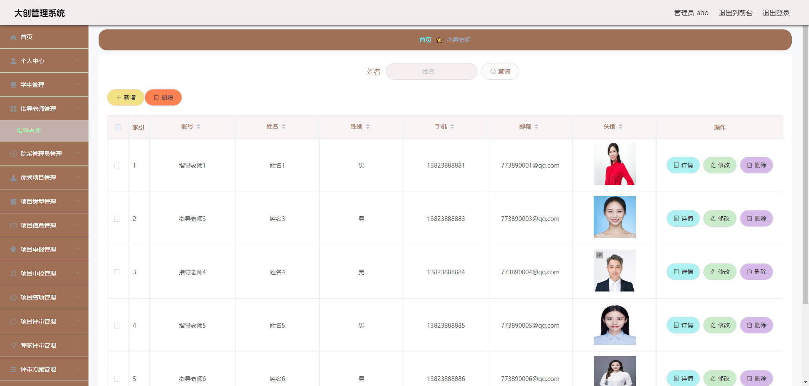
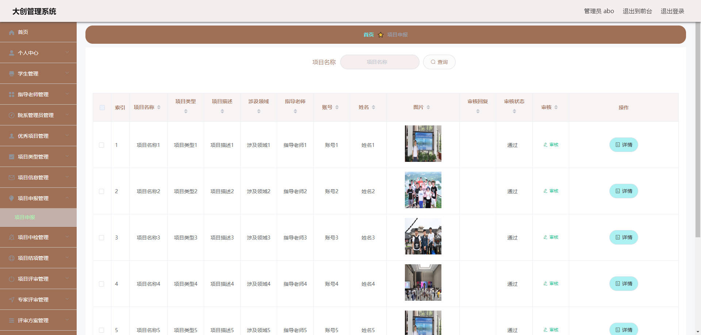
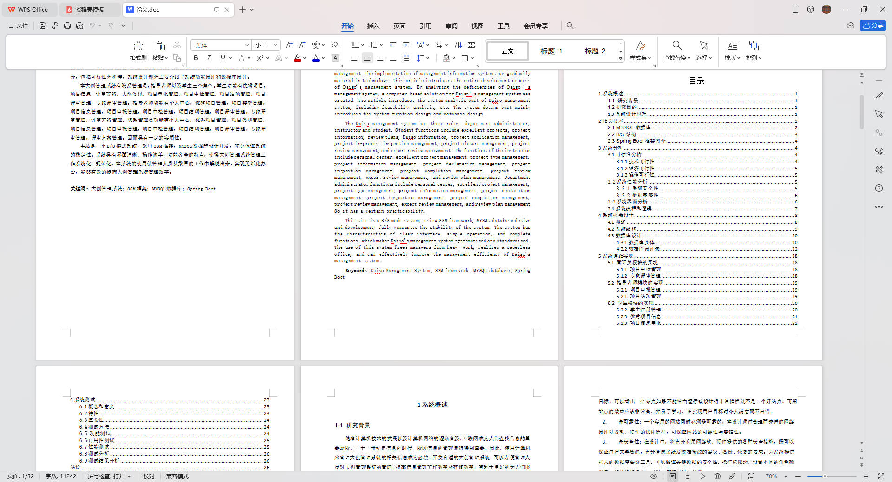

# 基于Springboot的大学生创业管理系统

## Springboot-0070


## 技术栈

Springboot mybatisplus vue mysql maven


## 数据库表(16张)


## 功能介绍

```properties
本大创管理系统有院系管理员，指导老师以及学生三个角色。

学生功能有优秀项目，项目信息，评审方案，大创资讯，项目申报管理，项目中检管理，项目结项管理，项目评审管理，专家评审管理。

指导老师功能有个人中心，优秀项目管理，项目类型管理，项目信息管理，项目申报管理，项目中检管理，项目结项管理，项目评审管理，专家评审管理，评审方案管理。

院系管理员功能有个人中心，优秀项目管理，项目类型管理，项目信息管理，项目申报管理，项目中检管理，项目结项管理，项目评审管理，专家评审管理，评审方案管理。
```


## 图片

### 前台


### 后台








## 访问路径

### 前台

```properties
http://localhost:8080/springbootj2zt8/front/pages/login/login.html

账号 1
密码 1
```

### 后台

```properties
http://localhost:8080/springbootj2zt8/admin/dist/index.html#/login

账号 abo
密码 abo
```


## 功能图


## 文档目录




## 打赏或交流


